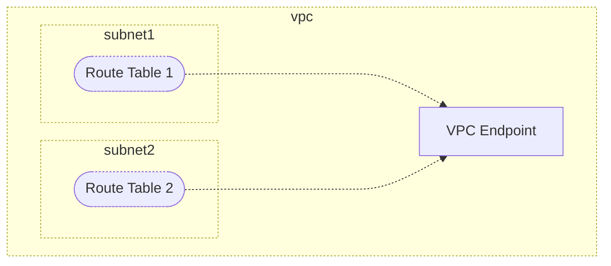

# `aws/gateway-vpc-endpoint`

Create VPC Endpoint with type "Gateway".

## Diagram

<!-- BEGIN_TF_DOCS -->
## Requirements

| Name | Version |
|------|---------|
|  [aws](#requirement\_aws) | ~> 5.0 |

## Providers

| Name | Version |
|------|---------|
|  [aws](#provider\_aws) | ~> 5.0 |

## Modules

No modules.

## Resources

| Name | Type |
|------|------|
| aws_vpc_endpoint.this | resource |
| aws_vpc_endpoint_route_table_association.this | resource |

## Inputs

| Name | Description | Type | Default | Required |
|------|-------------|------|---------|:--------:|
|  [base\_name](#input\_base\_name) | The base name for the resources. | `string` | `"mynetwork"` | no |
|  [policy](#input\_policy) | The policy document for the VPC endpoint. | `string` | `"{}"` | no |
|  [route\_table\_ids](#input\_route\_table\_ids) | Map of route table IDs (may be unknown at plan time) with arbitrary keys (must be known at plan time). | `map(string)` | n/a | yes |
|  [service\_name](#input\_service\_name) | The name of the AWS service for the VPC endpoint (e.g., com.amazonaws.us-west-2.s3). | `string` | n/a | yes |
|  [vpc\_id](#input\_vpc\_id) | The ID of the VPC where the endpoint will be created. | `string` | n/a | yes |

## Outputs

| Name | Description |
|------|-------------|
|  [prefix\_list\_id](#output\_prefix\_list\_id) | The prefix list ID associated with the VPC endpoint. |
|  [vpc\_endpoint\_id](#output\_vpc\_endpoint\_id) | The ID of the VPC endpoint created. |
<!-- END_TF_DOCS -->
