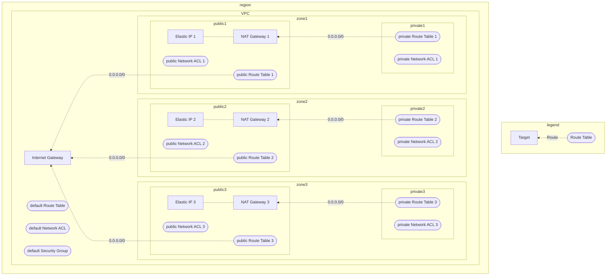
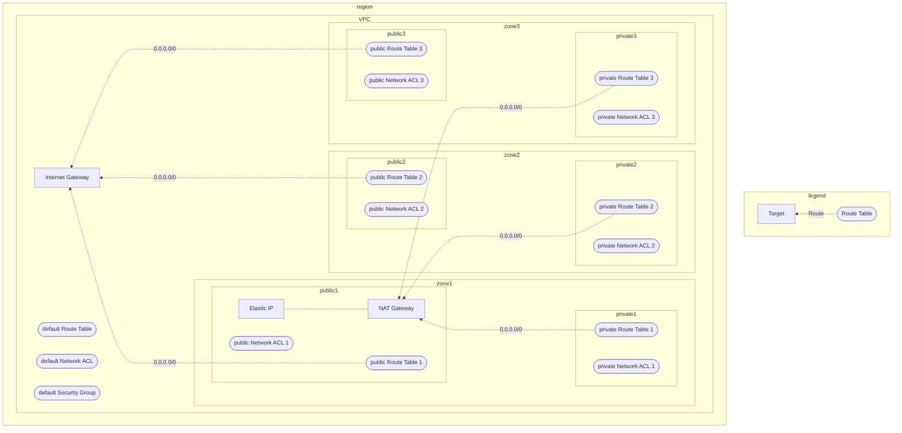

# `aws/simple-vpc`

Create simple (standard and easy) VPC.

This module creates:

- VPC
- You can change the number of availability zone to use.
  - Default: 3
- Public subnets
  - The number of public subnets is equal to the number of  availability zone to use.
  - Public subnets have default route to Internet Gateway of VPC.
- Private subnets
  - The number of public subnets is equal to the number of availability zone to use.
  - Private subnets have default route to NAT Gateway.
- Default SecurityGroup/NetworkACL/RouteTable entries will be cleared

## Diagram

### `nat_gateway_allocation = "ha"`

### `nat_gateway_allocation = "single"`

<!-- BEGIN_TF_DOCS -->
## Requirements

| Name | Version |
|------|---------|
|  [aws](#requirement\_aws) | ~> 5.0 |

## Providers

| Name | Version |
|------|---------|
|  [aws](#provider\_aws) | ~> 5.0 |

## Modules

No modules.

## Resources

| Name | Type |
|------|------|
| aws_default_network_acl.this | resource |
| aws_default_route_table.this | resource |
| aws_default_security_group.this | resource |
| aws_eip.natgw | resource |
| aws_internet_gateway.this | resource |
| aws_nat_gateway.this | resource |
| aws_network_acl.private | resource |
| aws_network_acl.public | resource |
| aws_network_acl_association.private | resource |
| aws_network_acl_association.public | resource |
| aws_network_acl_rule.private_allow_all_egress | resource |
| aws_network_acl_rule.private_allow_all_ingress | resource |
| aws_network_acl_rule.public_allow_all_egress | resource |
| aws_network_acl_rule.public_allow_all_ingress | resource |
| aws_route.private_to_natgw | resource |
| aws_route.public_to_igw | resource |
| aws_route_table.private | resource |
| aws_route_table.public | resource |
| aws_route_table_association.private | resource |
| aws_route_table_association.public | resource |
| aws_subnet.private | resource |
| aws_subnet.public | resource |
| aws_vpc.this | resource |
| aws_availability_zones.available | data source |
| aws_partition.current | data source |
| aws_region.current | data source |

## Inputs

| Name | Description | Type | Default | Required |
|------|-------------|------|---------|:--------:|
|  [availability\_zone\_count](#input\_availability\_zone\_count) | The number of availability zones to use. | `number` | `3` | no |
|  [base\_name](#input\_base\_name) | The base name for the resources. | `string` | `"mynetwork"` | no |
|  [cidr\_block](#input\_cidr\_block) | The CIDR block for the VPC. | `string` | `"10.0.0.0/16"` | no |
|  [enable\_dns\_hostnames](#input\_enable\_dns\_hostnames) | Whether to enable DNS hostnames in the VPC. | `bool` | `true` | no |
|  [enable\_dns\_support](#input\_enable\_dns\_support) | Whether to enable DNS support in the VPC. | `bool` | `true` | no |
|  [enable\_network\_address\_usage\_metrics](#input\_enable\_network\_address\_usage\_metrics) | Whether to enable network address usage metrics in the VPC. | `bool` | `true` | no |
|  [enable\_resource\_name\_dns\_a\_record\_on\_launch](#input\_enable\_resource\_name\_dns\_a\_record\_on\_launch) | Whether to enable resource name DNS A record on launch. | `bool` | `true` | no |
|  [instance\_tenancy](#input\_instance\_tenancy) | The instance tenancy for the VPC. | `string` | `"default"` | no |
|  [nat\_gateway\_allocation](#input\_nat\_gateway\_allocation) | Type of NAT Gateway allocation. ("single" or "ha") | `string` | `"single"` | no |
|  [private\_dns\_hostname\_type\_on\_launch](#input\_private\_dns\_hostname\_type\_on\_launch) | The private DNS hostname type on launch. | `string` | `"ip-name"` | no |

## Outputs

| Name | Description |
|------|-------------|
|  [availability\_zone\_id\_to\_name](#output\_availability\_zone\_id\_to\_name) | A map of availability zone IDs to names. |
|  [availability\_zone\_ids\_to\_use](#output\_availability\_zone\_ids\_to\_use) | The availability zone IDs to use. |
|  [availability\_zone\_name\_to\_id](#output\_availability\_zone\_name\_to\_id) | A map of availability zone names to IDs. |
|  [availability\_zone\_names\_to\_use](#output\_availability\_zone\_names\_to\_use) | The availability zone names to use. |
|  [az\_id\_to\_private\_subnet\_id](#output\_az\_id\_to\_private\_subnet\_id) | A map of availability zone IDs to private subnet IDs. |
|  [az\_id\_to\_public\_subnet\_id](#output\_az\_id\_to\_public\_subnet\_id) | A map of availability zone IDs to public subnet IDs. |
|  [default\_route\_table\_id](#output\_default\_route\_table\_id) | The ID of the default route table (not used) for the VPC |
|  [internet\_gateway\_id](#output\_internet\_gateway\_id) | The ID of the Internet Gateway |
|  [nat\_gateway\_ids](#output\_nat\_gateway\_ids) | The IDs of the NAT Gateways |
|  [private\_route\_table\_ids](#output\_private\_route\_table\_ids) | The IDs of the private route tables |
|  [private\_subnet\_id\_to\_az\_id](#output\_private\_subnet\_id\_to\_az\_id) | A map of private subnet IDs to availability zone IDs. |
|  [private\_subnet\_ids](#output\_private\_subnet\_ids) | The list of IDs of the private subnets. |
|  [public\_route\_table\_ids](#output\_public\_route\_table\_ids) | The IDs of the public route tables |
|  [public\_subnet\_id\_to\_az\_id](#output\_public\_subnet\_id\_to\_az\_id) | A map of public subnet IDs to availability zone IDs. |
|  [public\_subnet\_ids](#output\_public\_subnet\_ids) | The list of IDs of the public subnets. |
|  [vpc\_id](#output\_vpc\_id) | The ID of the VPC |
<!-- END_TF_DOCS -->
